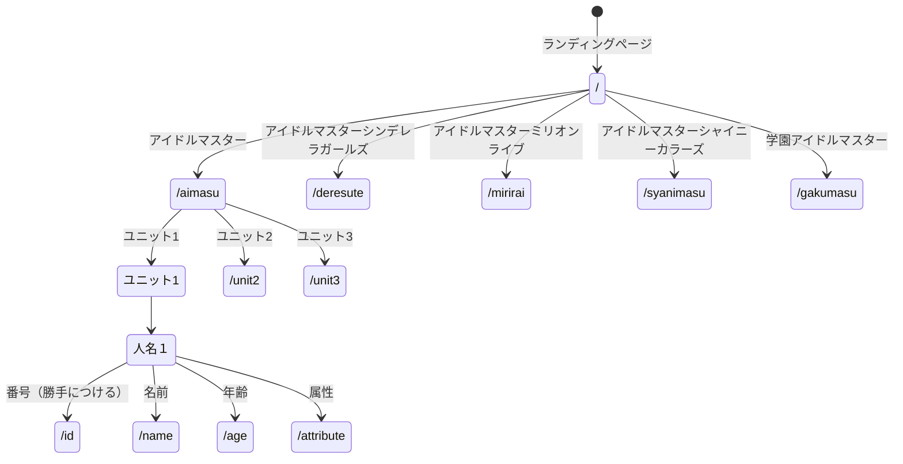
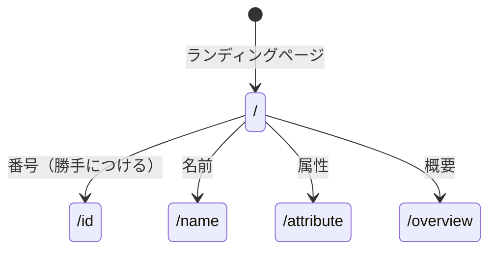

# 開発者仕様書（仮）
## 概要
## HTTPメソッドとリソース名一覧
## データ構造
## ページ遷移
どうやってページ遷移するか？（ページ内のリンク，クリックする場所など）
HTTPメソッドとリソース名
追加・削除・編集後に表示する内容

## リソース名ごとの機能の詳細

## mermaid
kononakakarahitotuerabu
### aimasu_kari

### youkai_kari
