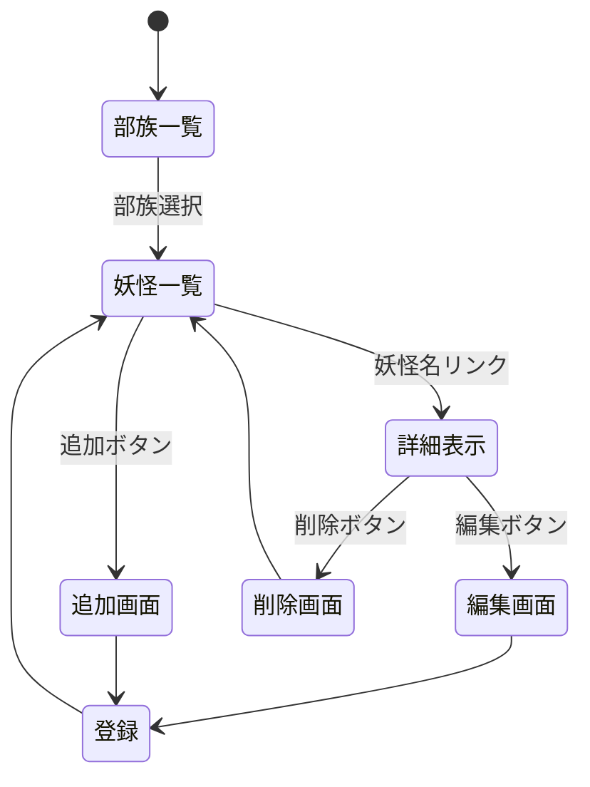

# 開発者仕様書（仮）
## 概要
本システムは，妖怪ウォッチのキャラクター情報を
Webブラウザ上で一覧・追加・編集・削除（CRUD）できる管理アプリケーション である．
Node.js（Express）を利用したサーバサイドアプリケーションであり，学習目的のため
「データ構造の扱い」「ルーティング」「テンプレート処理」を理解することを目的としている．

以下のような階層構造を持ち，ユーザは階層を辿りながら情報にアクセスする．
・部族（プリチー族など）→ 妖怪一覧 → 詳細情報
## HTTPメソッドとリソース名一覧
## データ構造
## ページ遷移
どうやってページ遷移するか？（ページ内のリンク，クリックする場所など）
HTTPメソッドとリソース名
追加・削除・編集後に表示する内容

## リソース名ごとの機能の詳細

